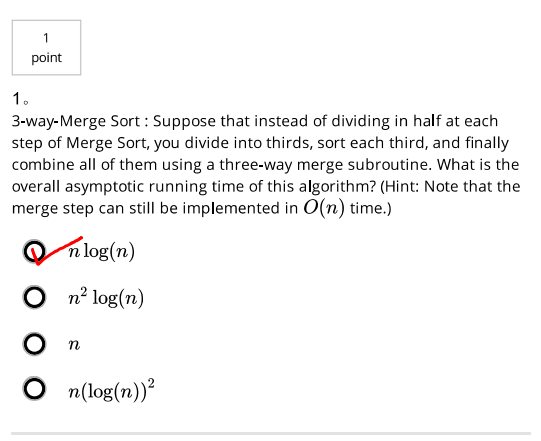
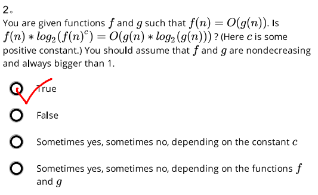
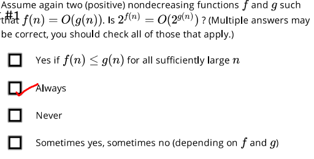
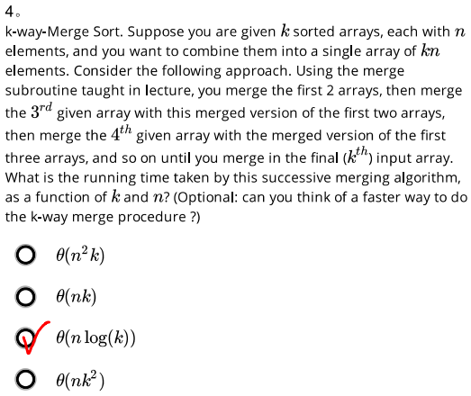
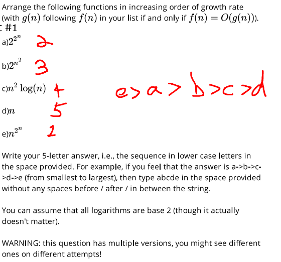

# Problem Set 1
1. 
The answer is quite intuitive. Similarly to 2-way-Merge Sort, at the i-th level, number of problems will
be 3^i many, and input length of each problem will be n/(3^i). The total instruction number is O(nlog3(n)).
Also, nlog3(n) <= nlog2(n) for all n >=1

2. since f(n) = O(g(n)), there exists constants n1 and a1 s.t. f(n) <= a1*g(n) for all n>=n1  
Then log2(f(n)) <= log2(a1*g(n)) <= log2(a1) + log2(g(n))
For f, g non-decreasing and always larger than 1, and log2(a1) a constant, there exists a constant a2 s.t.
log2(a1) = k*log2(g(n)) for all n>=n1
Then log2(f(n)) <= (k+1)log2(g(n)) for all n >=n1
Then log2(f(n)^c) == clog2(f(n)) <= c(k+1)log2(g(n)) for all n >=n1
we choose x0 = x1, and c = c(k+1), Q.E.D.

3. Similar
2^(f(n)) <= 2^a * 2^(g(n)) for all n>=x1
choose x0 = x1 and c= 2^a

4. I chose the most familiar answer without thinking

5. Did this by intuition
