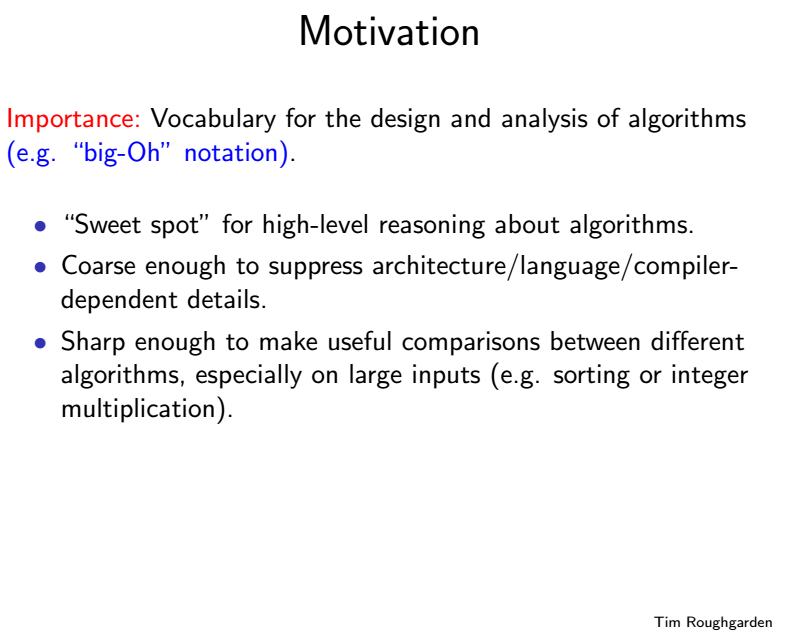
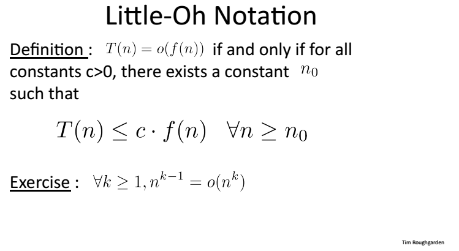

# 1.1.2 Asyptotic Analysis
## The Gist
Why study the vocabulary for algorithm and asymptotic analysis?

The idea is to suppress constant factors and low-order terms.
Three examples are given:
	1. One Loop: O(n)
	2. Two Loops: O(n)
	3. Two Nested Loops: O(n^2)
## Definition of the Big-O Notation

That is to say, if we want to verify if T(n) = O(f(n)), we need to find two independent constants x0 and c, such that for arbitrary x>=x0, T(n) <=c*O(f(n)).  
### Examples
1. 
2. 
## Omega & Theta Notations
1. Omega Notation: the algorithm's running time is bounded below.

2. Theta Notation: similar to the sandwich theorem, the running time of the algorithm is bounded in between.

3. Little-Oh Notation

Few examples are given afterwards.

