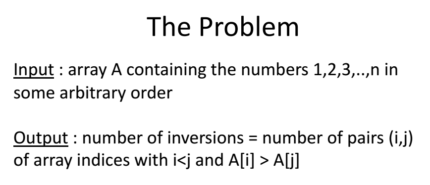
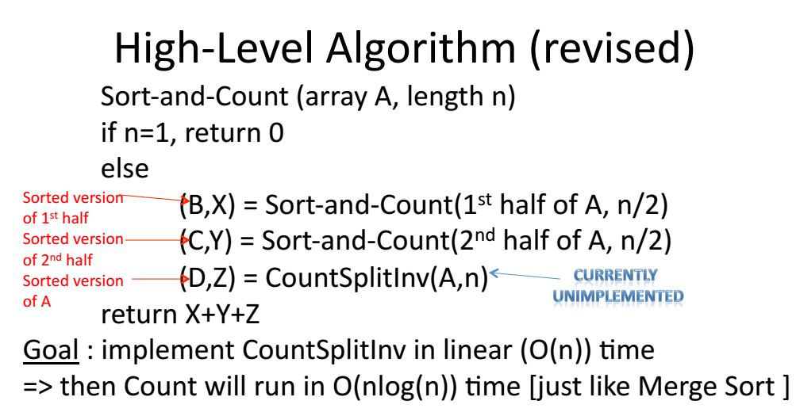
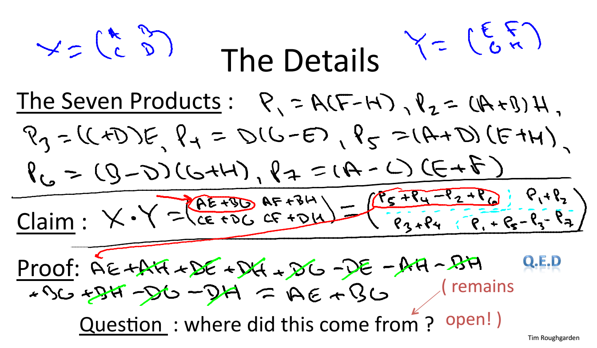

#1.2.1 Divide and Conquer Algorithms  
## The divide and conquer paradigm:  
	1. divide into smaller sub-problems  
	2. conquer via recursion  
	3. combine solutions (usually the step that takes most thinking time)  

## The problem - example  

Inversion paris,  motivation is to determine how similar two arrays are  
Key idea: divide and concquer  

## The idea is to piggyback merge-sort along the way.  

## Strassens' Subcubic Matrix Multiplication  
